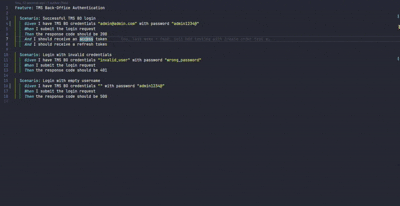
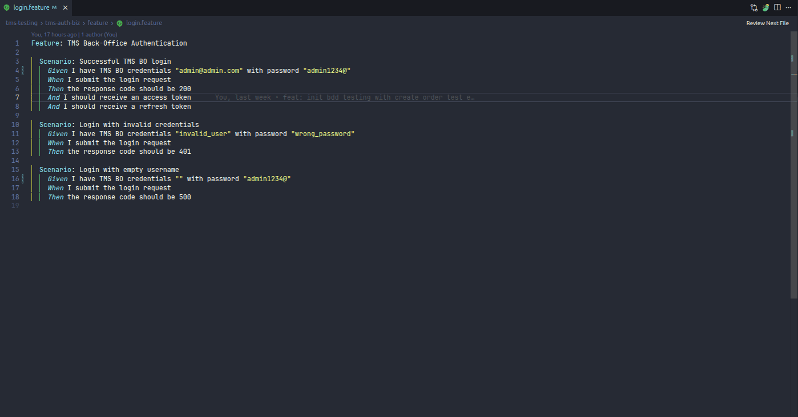

# Cucumber Jump

**Cucumber Jump** connects **Gherkin `.feature` files** with **Go** code in projects that use a generated **step map** (for example [godog](https://github.com/cucumber/godog)): one file lists every step’s **regex and wiring**, and separate files hold the **real logic**.

Install from the **Visual Studio Marketplace** (VS Code) or your editor’s extension panel — search **Cucumber Jump** (publisher **lntvan166**). Open a workspace that contains both `.feature` files and the configured Go paths, then add the settings below.

---

## Demos

### Demo 1 — Jump between `.feature` and Go

This shows **bidirectional navigation**: from a Gherkin step to the right Go place, and from Go back to the scenario.



### Demo 2 — Dev mode (paired panes)

**Dev mode** pins a **split layout**: **implementation / registry on the left**, **`.feature` on the right**. When you **move the caret on a step line on the right**, the **left editor** updates to the matching Go code. When you **move inside paired Go** (bdd or steps file), the **right** scrolls to the linked feature line.

Start or stop it from the **cucumber icon** in the **`.feature`** editor title bar, from the command palette (**Toggle Dev mode** / **Open Dev mode**), or via the **DEV · …** status bar item. Full behavior and commands are in **Dev mode** later in this README.



---

## How your repo maps to settings

| Concept                 | Typical files                        | Role                                                                                                                                                      |
| ----------------------- | ------------------------------------ | --------------------------------------------------------------------------------------------------------------------------------------------------------- |
| **Step registry**       | `bdd.go`, `common_bdd.go`, …         | **All steps are registered here**: comment + regex key → thin wrapper that calls a handler. This is what **`bddFile`** points to.                         |
| **Step implementation** | `*_steps.go` (e.g. `login_steps.go`) | **Business logic** for each step: real `func` bodies. This is what **`stepsGlob`** must find.                                                             |
| **Feature specs**       | `*.feature`                          | Gherkin scenarios; each step line is resolved via the registry, then the implementation. **`featureGlob`** selects which features belong to which module. |

Resolution order from a `.feature` step: **matching `projects` entry first**, then each **`libraries`** entry in order until a match is found.

---

## Settings (`cucumberJump.*`)

All paths are **relative to the workspace folder** (the root you opened in VS Code / Cursor).

### `cucumberJump.projects` (array)

Each object describes **one service or module** that has its own features + Go test layout.

| Field             | Required | Meaning                                                                                                               |
| ----------------- | -------- | --------------------------------------------------------------------------------------------------------------------- |
| **`featureGlob`** | yes      | Glob for `.feature` files owned by this module, e.g. `services/my-api/feature/**/*.feature`.                          |
| **`bddFile`**     | yes      | The **step registry** file: generated map of regex → handler call. Can be a fixed path or a `**` pattern (see below). |
| **`stepsGlob`**   | yes      | Glob for **implementation** files, usually `*_steps.go` next to `bdd.go`.                                             |
| **`name`**        | no       | Optional label; only for your own documentation in JSON.                                                              |

If several `featureGlob` values match the same file, the extension prefers the entry whose **`bddFile`** lives under the **same package root** as the feature file (the path segment **before** `/feature/`).

### `cucumberJump.libraries` (array)

Same shape as **`projects`**: `featureGlob`, **`bddFile`** (shared registry), **`stepsGlob`** (shared `*_steps.go`). Used for **shared** steps (e.g. a `common` package). Searched **after** the matching project, in **array order**.

### `cucumberJump.includeStepRegistryInDefinition`

- **`false`** (default): **Go to Definition** / Ctrl+click on a step prefers **only** the **`*_steps.go`** implementation when it resolves; if not found, **`bdd.go`** is still used as a fallback.
- **`true`**: also offers the **registry line** in `bdd.go` (useful if you want both in one flow).

Palette commands **Go to Step Registry** and **Go to Implementation** are unchanged.

### `cucumberJump.codeLensEnabled`

Default **`false`**. When **`true`**, step lines in `.feature` files show **Implementation** and **Registry** CodeLens links.

### `cucumberJump.statusBarHintEnabled`

Default **`false`**. When **`true`**, on a `.feature` step line the status bar shows the resolved implementation path (debounced). Click opens **Show step resolution**.

### `cucumberJump.devModeDebounceMs`

Delay in milliseconds (default **200**, minimum **50**) before **Dev mode** syncs the paired editor after the cursor moves.

### Wildcards in `bddFile` and `stepsGlob`

If the pattern contains **`**`**, the extension builds a concrete path from the open feature’s **package root** (everything before `/feature/`). Example: `\*\*/testing/bdd.go`+`repo/my-svc/feature/x.feature`→`repo/my-svc/testing/bdd.go`.

---

## Example `settings.json`

```json
{
  "cucumberJump.projects": [
    {
      "name": "my-api",
      "featureGlob": "services/my-api/feature/**/*.feature",
      "bddFile": "services/my-api/testing/bdd.go",
      "stepsGlob": "services/my-api/testing/*_steps.go"
    }
  ],
  "cucumberJump.libraries": [
    {
      "name": "shared",
      "featureGlob": "libs/bdd-shared/feature/**/*.feature",
      "bddFile": "libs/bdd-shared/steps/common_bdd.go",
      "stepsGlob": "libs/bdd-shared/steps/*_steps.go"
    }
  ],
  "cucumberJump.includeStepRegistryInDefinition": false
}
```

---

## Dev mode (paired **Go** + **feature**)

Dev mode opens a **fixed layout**: **Go on the left**, **`.feature` on the right**, and keeps them in sync when you move the cursor (within the rules below).

### Title bar button (on `.feature` tabs)

- In the **editor title bar** (same area as editor actions), look for the **Cucumber Jump** icon on **`.feature`** tabs.
- **Cucumber icon** → start Dev mode for that feature (or switch pairing to this tab).
- **Close (×) icon** → this tab is the **paired** feature; click to **exit** Dev mode.

If the icon is hidden, open the **⋯** overflow menu on the title bar. Hover the control to see **Cucumber Jump: Toggle Dev mode**.

### Commands

- **Cucumber Jump: Toggle Dev mode** — same as the title bar control.
- **Cucumber Jump: Open Dev mode (Go left, feature right)** — start Dev mode when it is off.
- **Cucumber Jump: Close Dev mode** — stop pairing and clear the session.

You can open Dev mode with the cursor **anywhere** in a `.feature` file: the extension uses the **nearest** Gherkin step line (current line, then above, then below). If nothing resolves, it may open **`bdd.go`** on the left instead.

While Dev mode is on, a **status bar** item shows **`DEV · <file.feature>`**; **click** it for actions (focus feature, focus Go, close).

---

## Other navigation (short)

- **F12** on a `.feature` step (when the keybinding applies): **Go to primary step target** — jumps to the main Go target without relying on merged definition lists.
- **Cucumber Jump: Peek step targets** — pick list of this extension’s targets only.
- **`bdd.go`**: **Go to Definition** / **Find All References** in supported positions jumps to or lists **`.feature`** usages (per configuration).

Highlighting for `.feature` files comes from your **Gherkin / Cucumber** extension; Cucumber Jump does not replace it.

If you use the **official Cucumber** extension, set **`cucumber.glue`** to include your `*_steps.go` globs so its language server does not fight navigation on the same lines.

---

## License

MIT — see the `license` field in `package.json`.
