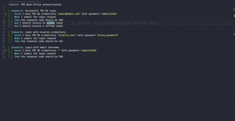
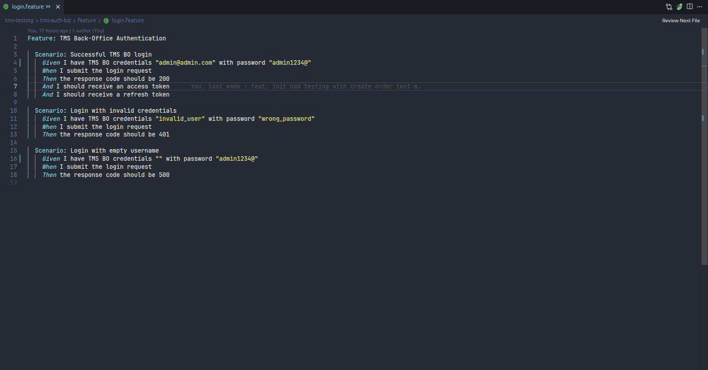

# Cucumber Jump

[](https://github.com/lntvan166/cucumber-jump-ext/actions/workflows/ci.yml)

**Cucumber Jump** connects **Gherkin `.feature` files** with step definitions across **Java, Kotlin, Python, JavaScript, TypeScript, Ruby, C#, Dart, and Go** — navigate from any step line straight to the implementation and back.

Install from the **Visual Studio Marketplace** (VS Code) or your editor's extension panel — search **Cucumber Jump** (publisher **lntvan166**). Open a workspace that contains both `.feature` files and the configured step paths, then add the settings below.

---

## Demos

### Demo 1 — Jump between `.feature` and implementation

This shows **bidirectional navigation**: from a Gherkin step to the right implementation, and from the implementation back to the scenario.



### Demo 2 — Dev mode (paired panes)

**Dev mode** pins a **split layout**: **implementation on the left**, **`.feature` on the right**. When you **move the caret on a step line**, the **left editor** updates to the matching code. When you **move inside the step file**, the **right** scrolls to the linked feature line.

Start or stop it from the **cucumber icon** in the **`.feature`** editor title bar, from the command palette (**Toggle Dev mode** / **Open Dev mode**), or via the **DEV · …** status bar item.



---

## Supported languages

The extension **auto-detects the language** from the file extension in your `stepsGlob`. No `language` field needed.

| Language | Step file extension | Framework |
|---|---|---|
| Java | `.java` | Cucumber-JVM |
| Kotlin | `.kt` | Cucumber-JVM |
| Python | `.py` | behave (full support), pytest-bdd (`@given`/`@when`/`@then` decorators only) |
| JavaScript | `.js` | cucumber-js |
| TypeScript | `.ts` | cucumber-js |
| Ruby | `.rb` | Cucumber-Ruby |
| C# | `.cs` | SpecFlow, Reqnroll |
| Dart | `.dart` | flutter\_gherkin |
| Go (new-style) | `.go` (no `bddFile`) | godog `ctx.Step()` |
| Go (legacy) | `.go` + `bddFile` | godog StepMap |

---

## Quick setup

### For Java, Python, JS/TS, Ruby, C#, Dart

Two fields are all you need — `featureGlob` and `stepsGlob`. The language is inferred automatically:

```json
{
  "cucumberJump.projects": [
    {
      "featureGlob": "src/test/**/*.feature",
      "stepsGlob": "src/test/**/*Steps.java"
    }
  ]
}
```

```json
{
  "cucumberJump.projects": [
    {
      "featureGlob": "features/**/*.feature",
      "stepsGlob": "features/steps/**/*.py"
    }
  ]
}
```

```json
{
  "cucumberJump.projects": [
    {
      "featureGlob": "e2e/**/*.feature",
      "stepsGlob": "e2e/step_definitions/**/*.ts"
    }
  ]
}
```

### For Go (godog standard `ctx.Step()` pattern)

Same two-field config — just point `stepsGlob` at your Go files:

```json
{
  "cucumberJump.projects": [
    {
      "featureGlob": "services/my-api/feature/**/*.feature",
      "stepsGlob": "services/my-api/testing/*_steps.go"
    }
  ]
}
```

### For Go (legacy StepMap pattern)

If your project uses a **step registry file** (`bdd.go`) that maps regex patterns to handler functions, keep the three-field config — existing setups work without any changes:

```json
{
  "cucumberJump.projects": [
    {
      "featureGlob": "services/my-api/feature/**/*.feature",
      "bddFile": "services/my-api/testing/bdd.go",
      "stepsGlob": "services/my-api/testing/*_steps.go"
    }
  ]
}
```

---

## Quick setup with an AI assistant

If your editor has an **AI chat** (e.g. GitHub Copilot Chat, Cursor, Codeium), paste the setup prompt so the assistant inspects your tree and proposes `cucumberJump` entries for `.vscode/settings.json`.

1. Open your project as the **workspace root** so paths resolve correctly.
2. Copy the prompt: **[Open raw file](https://github.com/lntvan166/cucumber-jump-ext/raw/main/docs/ai-setup-prompt.txt)** (select all → copy), or expand the block below.
3. Paste into your AI chat and ask it to merge the settings (or show a diff first). **Review** the JSON before saving.

<details>
<summary><strong>Setup prompt</strong> (expand to copy) — also available as <a href="https://github.com/lntvan166/cucumber-jump-ext/raw/main/docs/ai-setup-prompt.txt">raw</a></summary>

```text
You are helping configure Cucumber Jump (VS Code / Cursor extension, publisher lntvan166) for this workspace.

Context: The workspace root is opened in a VS Code–compatible editor. All paths in cucumberJump settings are relative to that workspace folder.

Cucumber Jump supports Java, Kotlin, Python, JavaScript, TypeScript, Ruby, C#, Dart, and Go. The language is auto-detected from the stepsGlob file extension — no language field is needed. For most languages only two fields are required: featureGlob and stepsGlob.

Tasks:
1. Discover all *.feature files and infer each BDD "package root" (the directory segment before /feature/ in the path, or the folder that groups one BDD module).
2. For each distinct layout, identify the language from the step file extensions, then locate the step definition files. For Go projects using a godog StepMap registry (bdd.go / *_bdd.go), also locate that registry file for the bddFile field. For all other languages (Java, Python, JS/TS, Ruby, C#, Dart) and for Go projects using standard ctx.Step() registration, bddFile is not needed.
3. Monorepo / many services: if every module uses the same relative layout, prefer one cucumberJump.projects entry with ** in featureGlob and stepsGlob. Do not emit one projects object per service — it bloats the array. Add multiple projects entries only when layouts genuinely differ.
4. Add cucumberJump.libraries entries only for shared/common features and shared step definitions. Libraries are searched after the matching project, in array order.
5. Merge cucumberJump.projects, cucumberJump.libraries, and optional keys into .vscode/settings.json. Preserve every existing unrelated setting. Create .vscode/settings.json if missing.
6. If the official Cucumber extension is used, suggest cucumber.glue globs that include the same step definition paths so its language server does not conflict with Cucumber Jump on step lines.
7. Conflicting Cucumber / Gherkin extensions: Inspect the workspace for other step-definition providers. Known overlaps: Cucumber (Gherkin) Full Support (alexkrechik.cucumberautocomplete) and Cucumber (CucumberOpen.cucumber-official). Prefer F12 (Go to primary step target) for Jump-only navigation, or recommend Disable (Workspace) for the other extension if the team wants a single provider. Merge cucumberJump.notifyConflictingExtensions: true (default) so editors show the one-time in-IDE notice.
8. Multi-root workspaces: if multiple folders are opened, settings may need per-folder .vscode/settings.json or the correct scope for each root.
9. After editing, explain how to verify: open a .feature, put the caret on a step line, press F12 (Go to primary step target) or Go to Definition; use the command "Cucumber Jump: Show step resolution" if something fails.
10. Glob pitfalls (not regex): prefer ** from a stable parent rather than prefix-* style globs in the middle of paths.

Output: proposed JSON fragment or full merged settings.json. If you cannot write files, show the diff clearly and remind the human to review before saving.
```

</details>

---

## How settings map to your project

### Step registration patterns recognized

**Java / Kotlin** — annotation on the method:
```java
@Given("I have {int} cucumbers")
public void iHaveCucumbers(int n) { ... }
```

**Python** — decorator on the function:
```python
@given('I have {int} cucumbers')
def step_impl(context, n): ...
```

**JavaScript / TypeScript** — function call (string or regex):
```typescript
Given('I have {int} cucumbers', function(n) { ... })
When(/^the user logs in$/, () => { ... })
```

**Ruby** — block form (string or regex):
```ruby
Given('I have {int} cucumbers') do |n| ... end
When(/^the user logs in$/) do ... end
```

**C#** — attribute on the method:
```csharp
[Given("I have {int} cucumbers")]
public void IHaveCucumbers(int n) { ... }
```

**Dart** — registration call:
```dart
given1<int>('I have {int} cucumbers', (world, n) async { ... })
```

**Go (new-style)** — `ctx.Step()` / `s.Step()` call:
```go
ctx.Step(`^I have (\d+) cucumbers$`, iHaveCucumbers)
```

**Go (legacy StepMap)** — registry file + handler in separate files (requires `bddFile`):
```go
// in bdd.go
`^I have (\d+) cucumbers$`: func(state *State) error {
    return iHaveCucumbers(state)
},
```

---

## Settings (`cucumberJump.*`)

All paths are **relative to the workspace folder**.

### `cucumberJump.projects` (array)

Each object describes **one service or module**.

| Field | Required | Meaning |
|---|---|---|
| **`featureGlob`** | yes | Glob for `.feature` files owned by this module. |
| **`stepsGlob`** | yes | Glob for step definition files. Extension determines the language. |
| **`bddFile`** | no — Go legacy only | The **step registry** file (godog StepMap pattern). Omit for all other languages and for Go projects using `ctx.Step()`. |
| **`name`** | no | Optional label for your own documentation. |

If several `featureGlob` values match the same file, the extension prefers the entry whose `bddFile` (or `stepsGlob` root) lives under the **same package root** as the feature file.

### `cucumberJump.libraries` (array)

Same shape as `projects`. Used for **shared** steps searched **after** the matching project.

### `cucumberJump.includeStepRegistryInDefinition`

Go legacy only. Default **`false`**: **Go to Definition** prefers the implementation file; falls back to `bdd.go`. Set **`true`** to also list the registry line.

### `cucumberJump.codeLensEnabled`

Default **`false`**. When **`true`**, step lines in `.feature` files show **Implementation** and **Registry** CodeLens links.

### `cucumberJump.statusBarHintEnabled`

Default **`false`**. When **`true`**, on a `.feature` step line the status bar shows the resolved implementation path. Click opens **Show step resolution**.

### `cucumberJump.devModeDebounceMs`

Delay in milliseconds (default **200**, minimum **50**) before **Dev mode** syncs the paired editor.

### Wildcards in `bddFile` and `stepsGlob`

If the pattern contains **`**`**, the extension builds a concrete path from the feature's **package root** (everything before `/feature/`). Example: `**/testing/bdd.go` + `repo/my-svc/feature/x.feature` → `repo/my-svc/testing/bdd.go`.

---

## Example `settings.json`

### Multi-language monorepo

```json
{
  "cucumberJump.projects": [
    {
      "name": "java-api",
      "featureGlob": "services/java-api/src/test/**/*.feature",
      "stepsGlob": "services/java-api/src/test/**/*Steps.java"
    },
    {
      "name": "python-worker",
      "featureGlob": "services/python-worker/features/**/*.feature",
      "stepsGlob": "services/python-worker/features/steps/**/*.py"
    },
    {
      "name": "go-service",
      "featureGlob": "services/go-service/feature/**/*.feature",
      "stepsGlob": "services/go-service/testing/*_steps.go"
    }
  ]
}
```

### Go legacy (existing users — no changes needed)

```json
{
  "cucumberJump.projects": [
    {
      "name": "my-api",
      "featureGlob": "services/my-api/feature/**/*.feature",
      "bddFile": "services/my-api/testing/bdd.go",
      "stepsGlob": "services/my-api/testing/*_steps.go"
    }
  ],
  "cucumberJump.libraries": [
    {
      "name": "shared",
      "featureGlob": "libs/bdd-shared/feature/**/*.feature",
      "bddFile": "libs/bdd-shared/steps/common_bdd.go",
      "stepsGlob": "libs/bdd-shared/steps/*_steps.go"
    }
  ]
}
```

---

## Dev mode (paired panes)

Dev mode opens a **fixed layout**: **implementation on the left**, **`.feature` on the right**, and keeps them in sync when you move the cursor.

### Title bar button (on `.feature` tabs)

- **Cucumber icon** → start Dev mode for that feature.
- **Close (×) icon** → this tab is the **paired** feature; click to **exit** Dev mode.

If the icon is hidden, open the **⋯** overflow menu on the title bar.

### Commands

- **Cucumber Jump: Toggle Dev mode** — same as the title bar control.
- **Cucumber Jump: Open Dev mode** — start Dev mode when it is off.
- **Cucumber Jump: Close Dev mode** — stop pairing and clear the session.

While Dev mode is on, a **status bar** item shows **`DEV · <file.feature>`**; **click** it for actions.

---

## Other navigation

- **F12** on a `.feature` step: **Go to primary step target** — jumps to the implementation without relying on merged definition lists.
- **Cucumber Jump: Peek step targets** — pick list of this extension's targets only.
- **From a step file**: **Go to Definition** / **Find All References** jumps to or lists `.feature` usages.
- **Cucumber Jump: Show step resolution** — opens the output panel with a step-by-step trace of how a step was resolved. Useful for diagnosing misses.

Highlighting for `.feature` files comes from your **Gherkin / Cucumber** extension; Cucumber Jump does not replace it.

### Coexisting with other Cucumber extensions

**Cucumber (Gherkin) Full Support** (`alexkrechik.cucumberautocomplete`) and the official **Cucumber** extension (`CucumberOpen.cucumber-official`) also register **Go to Definition** on `.feature` steps. VS Code **merges** all providers, which can produce duplicate or wrong targets.

1. Prefer **F12** (**Go to primary step target**) or **Cucumber Jump: Peek step targets** for Jump-only navigation.
2. If it still fights your workflow: **Extensions → Disable (Workspace)** the other extension.

**Notice:** If a conflicting extension is installed, Cucumber Jump shows a **one-time** editor notification (dismiss with *Don't show again*). Turn off with **`cucumberJump.notifyConflictingExtensions`**: **false**.

---

## License

MIT — see the `license` field in `package.json`.
